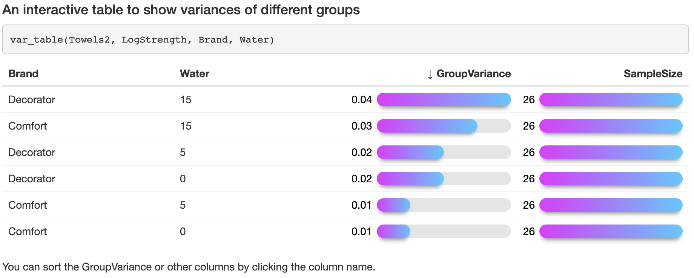
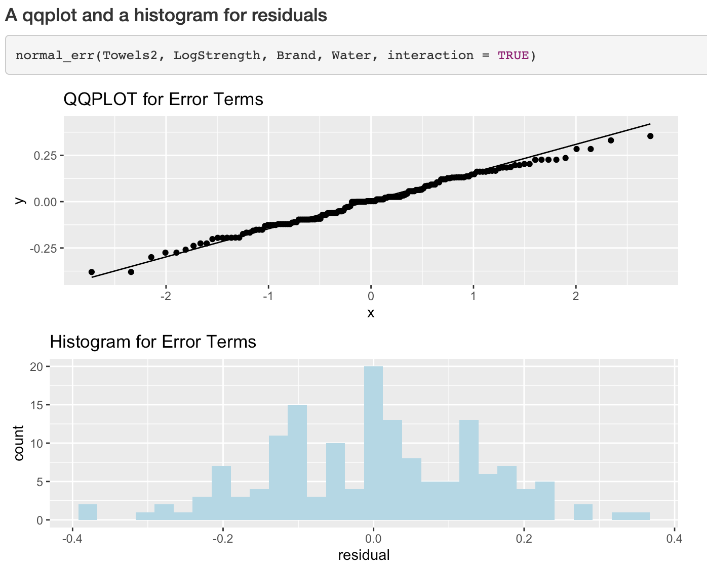
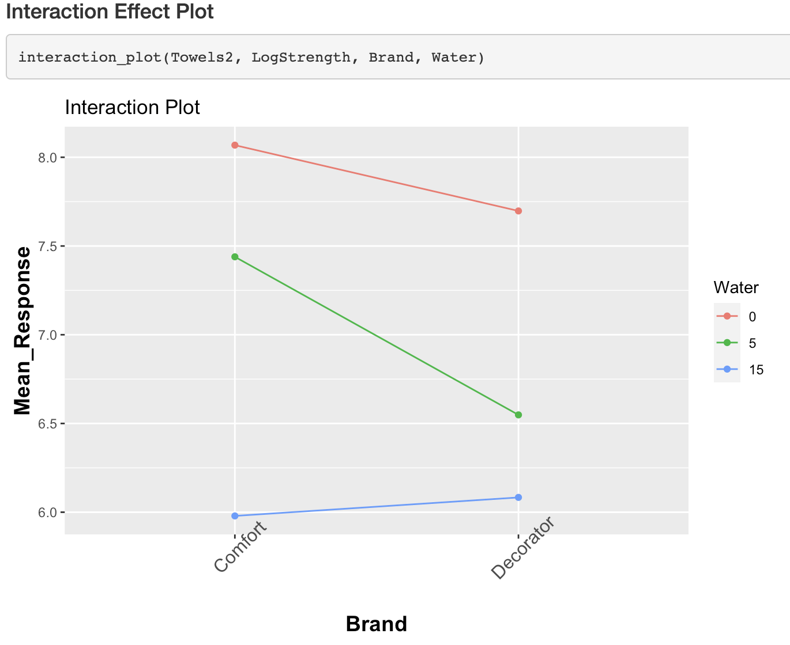

# easyExp
When you analyze and visualize your experiments, are you always bored with creating nice, concise, and easy-to-understand visualizations? From assumption checking to effects visualizations, everything can be done in one line with easyExp, whether one-way, two-way, or three-way ANOVA!

# Installation
```
# install.packages("devtools")
devtools::install_github("HuandongChang/easyExp")
```
# Motivation
When reviewing the packages in R we find that the experimental design packages have the fewest average number of contributors compared to other statistical fields that R provides. They also do not typically provide meaningful graphics options that address all types of variabilities. Without easily accessible graphics, it becomes challenging to validate the experiment assumptions and statistically analyze the experiment results efficiently, comprehensively, and rigorously. easyExp provides simple but powerful commands for users so that beginners like students can easily gain hands-on experiences and can focus more on experimental designs rather than commands. 


# Functions
**Checking ANOVA Assumptions**


1) equal variances within groups
```
# barplot
var_boxplot = function(dataset, response, x1, x2=NULL)

# scatterplot
var_scatterplot = function(dataset, response, x1, x2=NULL)

# interactive variance table
var_table = function(dataset, response, x1, x2=NULL, x3=NULL, type=1)
```


2) normally distributed residuals
```
# A qqplot and a histogram for residuals
normal_err = function(dataset, response, x1, x2=NULL, interaction = TRUE, bins = 30)

# or you can use residuals as input
normal_err = function(residuals, bins = 30)
```

3) independent and identically distributed observations
```
# Residual vs fit/order plots
iid = function(dataset, anova_model)
```

**Main Effect and Interaction Effect Plots**
```
# Main Effect Plots
main_plot = function(dataset, response, x1, x2, x3, ylim)

# Interaction Effect Plots
interaction_plot = function(dataset, response, x1, x2)
```


# Datasets Available in the Package
```
Bacteria
Cholesterol
Cups
MemoryA
Movies
Popcorn
Soda
Towels2
```


# Example
You can find a complete example
[here](http://htmlpreview.github.io/?https://github.com/HuandongChang/easyExp/blob/main/vignettes/introduction.html). Some highlights:








